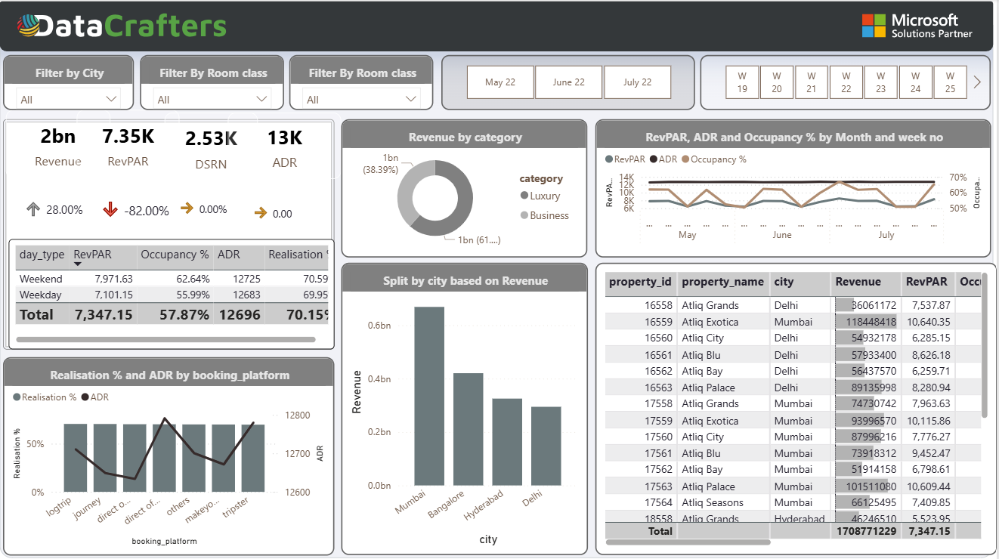

Power BI Hospitality Report - README

Overview
--
This Power BI report provides insights into key metrics for the hospitality sector, enabling data-driven decision-making. The dashboard aggregates and visualizes data to highlight performance indicators such as revenue, RevPAR, ADR, occupancy rates, and more, across various dimensions like cities, room classes, and booking platforms.

Features

Filters:

Filter by City: Narrow down metrics based on selected cities.

Filter by Room Class: View data segmented by room classifications.

Filter by Date: Select specific months (May 22, June 22, July 22) and corresponding weeks for more granular analysis.

Key Metrics:

Revenue: Total revenue generated (₹2bn).

RevPAR: Revenue per available room (7.35K).

DSRN: Daily Sold Room Nights (2.53K).

ADR: Average Daily Rate (₹13K).

Comparative Analysis:

Displays changes in key metrics (e.g., Revenue: +28%, RevPAR: -82%) compared to the previous period.

Detailed Breakdown:

Day-wise Analysis:

Weekend vs. Weekday metrics for RevPAR, Occupancy %, ADR, and Realization %.

Category-based Revenue:

Pie chart dividing revenue between Luxury (38.39%) and Business (61.61%).

Performance Trends:

Line chart showing RevPAR, ADR, and Occupancy % trends over months and weeks.

City-Based Revenue Split:

Bar chart representing revenue distribution among major cities: Mumbai, Bangalore, Hyderabad, and Delhi.

Booking Platform Performance:

Bar and line chart showing Realization % and ADR for various booking platforms (e.g., logtrip, journey, direct, makeyou, tripster).

Property-Level Data:

Detailed table listing property ID, property name, city, revenue, RevPAR, and occupancy %.

Data Highlights

Total Revenue: ₹1708.77 crore

Average RevPAR: 7,347.15

Occupancy Rate: 57.87%

ADR: ₹12,696

Usage

Use the filters at the top of the dashboard to refine the displayed data according to specific criteria.

Refer to the key metrics section to get a quick snapshot of overall performance.

Analyze trends and breakdowns through visualizations for a deeper understanding of performance drivers.

Drill into the property-level table to examine granular details and identify top-performing assets.

Key Insights

Luxury vs. Business Revenue Split: Business category contributes the majority (61%) of the revenue.

City-Level Insights: Mumbai generates the highest revenue, followed by Bangalore and Hyderabad.

Weekend Performance: Higher occupancy (62.64%) and RevPAR (7,971.63) compared to weekdays.

Booking Platform Efficiency: Direct and journey platforms show higher realization percentages and ADR values.
